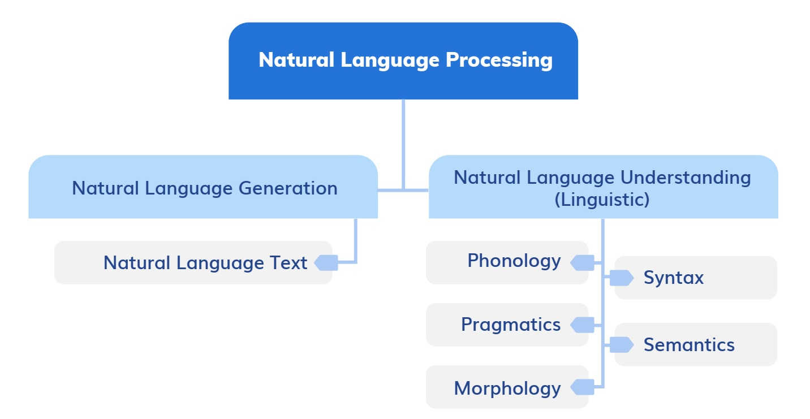

## Natural Language Processing (NLP)

**NLP** is the field of AI concerned with the interactions between computers and human (natural) languages, in particular how to program computers to process and analyse large amounts of natural language data.

Before we dive into NLP we need to understand the two types of data that exist: Structured and unstructured.    
Structured data is data that has a pre-defined specific format. For example, spreadsheets, tables, databases   
Unstructured data, on the other hand, is data that doesn’t follow a pre-defined specific format. For example, emails, chats, blogs, books, audio files, video files, images.   

Two parts to NLP: **Natural Language Understanding (NLU)** and **Natural Language Generation (NLG)***.    
NLU refers to mapping the given input from Natural Language into formal representation and analysing it.
NLG is the process of producing meaningful phrases and sentences in the form of natural language from some internal representation. NLG is generally much easier than NLU since
when we know the meaning that needs to be expressed, there are certain rules of language such as syntax and semantics that need to be followed in order to create an appropriate
sentence.

#### NLP use cases

| **Use case**                   | **Explanation**                                                                                                                                                                                                  |
|--------------------------------|------------------------------------------------------------------------------------------------------------------------------------------------------------------------------------------------------------------|
|     Sentiment   analysis       |     You   are the CEO   of a luxury travel company and you want to know   if the happiness of your customers affects your revenue.                                                                               |
|     Speech   recognition       |     to convert audio into text for further processing.                                                                                                                                                           |
|     Chatbots                   |     to provide 24/7/365 customer support.                                                                                                                                                                        |
|     Machine translation        |     to help   you reach new   markets with minimal investment.                                                                                                                                                   |
|     Autocompleting text        |     similar to what   Gmail does to   help you increase your employee’s efficiency   through a centralized knowledge base. Or to   improve how your   customers interact with your product / website.            |
|     Spell   checking           |     to make sure   that documents don’t   contain errors. Especially relevant in   industries with high   compliance requirements such   as banking, insurance and finance.                                      |
|     Keyword   search           |     to locate relevant information faster across all data facilities, leading to increased efficiency.                                                                                                           |
|     Advertisement matching     |     For example, when   you search for   a new car   on Google or write an   email about it   to a friend, you will later receive car adverts.                                                                   |
|     Information extraction     |     to extract the   essence from large   volumes of unstructured data.                                                                                                                                          |
|     Spam   detection           |     to clean   your email inbox.                                                                                                                                                                                 |
|     Text   generation          |     to create new   text, e.g. client   contracts, research documents, training materials, and so on.                                                                                                            |
|     Automatic summarization    |     to add summaries to existing   documents.                                                                                                                                                                    |
|     Questions answering        |     to answer specific questions based on   disparate information sources.                                                                                                                                       |
|     Image   captioning         |     to annotate images.                                                                                                                                                                                          |
|     Video   captioning         |     Videos can take a long time   to watch.     Sometimes   it’s faster to extract information from them in the form   of text and   then process it   further using other NLP techniques like summarization.    |
